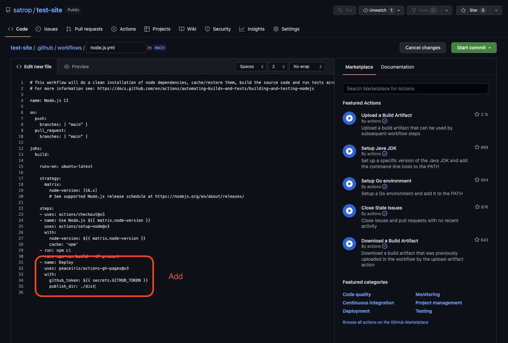

<h1>GH-Pages Setup</h1>

This is the simplest method I've found, and use, to set up Vite React app, initialize GitHub, set up a repo to receive the React app and, using GitHub workflow build and push to gh-pages.

### Notes

-   All terminal command are run in VSCodes built in terminal

---

## Setup A Single Page React App Using Vite

1. Run:

```sh
npm create vite@latest
```

2. Name project, needs to be all lower case and no special charters. If you already in your project folder use '.' for the name.
3. Select React.
4. Select your poison, TS, JS...
5. CD into your newly created project folder.

6. Run:

```sh
npm i
```

<br>
<div style='padding: 2rem; background-color:#E9D8FD; color:#69337A'>

<span style='font-weight: bold; font-size: 1.4rem;'>Optional Instals</span>

1. If using SCSS run:

```sh
npm i sass
```

2. If using router run:

```sh
npm i react-router-dom@6
```

</div>
<br>

7. Run:

```sh
npm run dev
```

8. Your site will build and you can `opt + click` on the localhost URL in the terminal to view site.

9. Open the `vite.config.js` in your projects root and add:

```js
css: {
	devSourcemap: true,
},
base: '/project-name/',
```

### Example:

```js
import { defineConfig } from 'vite';
import react from '@vitejs/plugin-react';

export default defineConfig({
	plugins: [react()],
	css: {
		devSourcemap: true,
	},
	base: '/project-name/', // <-- Change the 'project-name' to your project name
});
```

1.  Open the `package.json` file and add:

```js
"homepage": "/project-name/",
```

### Example:

```js
{
	"name": "my-app",
	"private": true,
	"version": "0.0.0",
	"type": "module",
	"homepage": "/project-name/", // <-- Change the 'project-name' to your project name
}
```

---

## Initialize Git

11. Run:

```sh
git init
```

12. Run:

```sh
git add . && git commit -m "Init push"
```

13. Go to [GitHub](https://github.com/) and create new repo and call it what you like.
<p align="center">

</p>

14. Follow the "<b>…or push an existing repository from the command line</b>" instructions. Copy the instruction <b>from GitHub</b> because it will auto populate "your-account-name" and "project-name" and past that into your VSCodes terminal.

### Example:

```sh
git remote add origin https://github.com/{your-account-name}/{project-name}.git {<-- Change "your-account-name" and "project-name" }
git branch -M main
git push -u origin main
```

15. Got to Setting > Actions > General and under 'Workflow permissions' select 'Read and wright permissions'

<p align="center">

</p>

16. Save.

<p align="center">

</p>

16. Click on Actions tab and search for 'Node.js'

<p align="center">

</p>

17. Click on the configure button on the first result.

<p align="center">

</p>

19. In the editor that opens change:

```sh
 node-version: [14.x, 16.x, 18.x]
```

to:

```sh
 node-version: [16.x]
```

20. Remove:

```sh
 - run: npm test
```

<p align="center">

</p>

21. Under `- run: npm run build --if-present` add:

```sh
- name: Deploy
      uses: peaceiris/actions-gh-pages@v3
      with:
        github_token: ${{ secrets.GITHUB_TOKEN }}
        publish_dir: ./dist
```

<p align="center">

</p>

22. Now commit that file, top left, green button!

<p align="center">

</p>

At this point the work flow will go do its thing and after ~30 seconds it should be complete. In the root of you GitHub repo you should see a green check mark in the header. It'll one of three thing, the green check mark indicating that all is working as it should, and orange dot indicating that the build is in process or a red dot that indicate that the build failed. Should you get the red dot you can click on the dot and then Details in the pop up and take it from there. At this point you'll want to reach out to mother Google for help.

23. Now go to Settings > Pages and in the <b>Branch</b> section click on the dropdown that says "none" and select "gh-pages" as the branch. Then hit save.

<p align="center">

</p>

24. Wait ~30 seconds, (or constantly spam that refresh button like I do) and refresh the page and you'll see a link at the top indicating you app is live.

<p align="center">

</p>

25. Lastly, head back to VSCode and run:

```sh
git pull
```

It's important to pull all this before your next push! If you forget and run a `git push` you'll get a GitHub warning that "your current branch is behind" on your next push. If this happens you should be abbe to run:

```sh
git pull --rebase
```

26. If that returns:

```sh
Successfully rebased and updated refs/heads/main.
```

27. Go ahead and run:

```sh
git push
```

Now every time you make a change, `git push` and the GitHub workflow will build the project and push to you gh-pages.

---

## Setup A Multiple Page React App

Do all the steps above plus:

1. Import HashRouter, Routes and Route. HashRouter is the thing that saved me.

```jsx
import { HashRouter, Routes, Route } from 'react-router-dom';
```

2. Be sure to wrap you `<Routes>` with the `<HashRouter>`.

```jsx
export default function App() {
	return (
		<HashRouter>
			<Nav />
			<Routes>
				<Route index element={<Home />} />
				<Route path="/page1" element={<Page1 />} />
				<Route path="/page2" element={<Page2 />} />
				<Route path="/page3" element={<Page3 />} />
				<Route path="/page4" element={<Page4 />} />
			</Routes>
		</HashRouter>
	);
}
```

1. In your navigation component, import `Nav` or `NavLinks`. `NavLinks` will help add an active class to the current page in the navigation.

```jsx
import { NavLink } from 'react-router-dom';
```

1. Build you navigation as you see fit...

```jsx
<ul>
	<li>
		<NavLink to="/">Home</NavLink>
	</li>
	<li>
		<NavLink to="/page1">Page 1</NavLink>
	</li>
	<li>
		<NavLink to="/page2">Page 2</NavLink>
	</li>
	<li>
		<NavLink to="/page3">Page 3</NavLink>
	</li>
	<li>
		<NavLink to="/page4">Page 4</NavLink>
	</li>
</ul>
```

---
