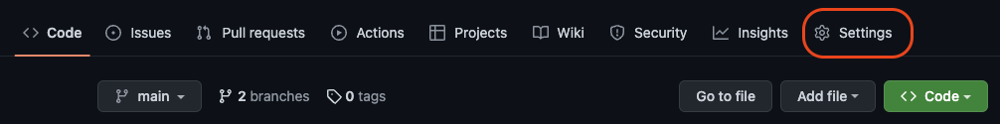
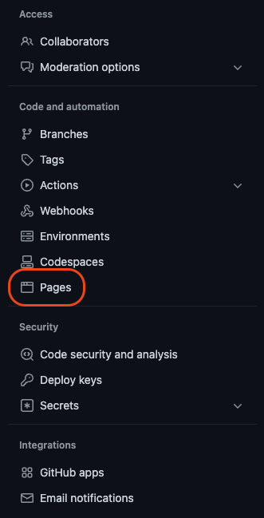
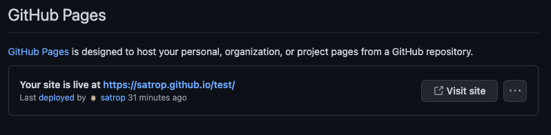

<h1>GH-Pages Setup</h1>

<h2>Table Of Contents</h2>

- [Setup A Single Page React App Using Vite](#setup-a-single-page-react-app-using-vite)
- [Setup A Single Page React App Using CRA (Create React App)](#setup-a-single-page-react-app-using-cra-create-react-app)
- [Setup A Multiple Page React App](#setup-a-multiple-page-react-app)

---

## Setup A Single Page React App Using Vite

Assuming you have already have you Vite React App setup.

1. Open the `vite.config.js` add: `base: '/project-name/',` exchange 'project-name' for the name of your project

```js
import { defineConfig } from "vite";
import react from "@vitejs/plugin-react";

// https://vitejs.dev/config/
export default defineConfig({
	base: "/project-name/", // <-- Change the 'project-name' to your project name
	plugins: [react()],
});
```

2. Open the `package.json` file and add `"homepage": "https://your-github.github.io/project-name/",`

```js
{
	"name": "my-app",
	"private": true,
	"version": "0.0.0",
	"type": "module",
	"homepage": "https://your-github.github.io/project-name/",
}
```

3. Still in the `package.json` file and add `"predeploy": "npm run build"` and `"deploy": "gh-pages -d dist"` to the scripts tag. This is slightly different that whats needed if your using a CRA which I'll show later [here](#setup-a-single-page-react-app-using-cra-create-react-app).

```js
"scripts": {
    "dev": "vite",
    "build": "vite build",
    "preview": "vite preview",
    "predeploy": "npm run build",
    "deploy": "gh-pages -d dist"
},
```

3. Open the VSCode terminal and run:

```bash
 npm i gh-pages --save-dev
```

4. Still in the terminal, run:

```bash
npm run deploy
```

This last line deploys to gh-pages. It can take a few minutes before the page shows up so go make a cup of :coffee:

Now that you've got your cup of something lets find that page.

-   Head on over to you repo.
-   In your repo click on 'settings'



-   In the `Code and automation` menu on the left select `Pages`



-   If all has gone to plan you should see something like this:



"Your site is live at <b>https://your-github.github.io/your-project-name</b>"

---

## Setup A Single Page React App Using CRA (Create React App)

Assuming you've set up your CRA.

<b>There is NO `config.js` file to set up!</b>

1. Open the `package.json` file and add `"homepage": "https://your-github.github.io/project-name/",`

```js
{
	"name": "my-app",
	"version": "0.1.0",
	"private": true,
	"homepage": "https://your-github.github.io/project-name/",
}
```

2. This is the difference between the CRA and Vite React App. Open the `package.json` file and add `"predeploy": "npm run build"` and `"deploy": "gh-pages -d build"` to the scripts tag. Here we are deploying a "build" folder over a "dist" folder. You could change the name of this folder but I imagine this would take some extra steps so I just roll with what comes out of the box.

```js
"scripts": {
	"start": "react-scripts start",
	"build": "react-scripts build",
	"test": "react-scripts test",
	"eject": "react-scripts eject",
	"predeploy": "npm run build",
	"deploy": "gh-pages -d build" // <-- This is the only difference
},
```

After this you can follow all the same steps from step 3 [above](#setup-a-single-page-react-app-using-vite).

---

## Setup A Multiple Page React App

Follow all the steps above for deploying either a [CRA](#setup-a-single-page-react-app-using-vite) or [Vite React App](#setup-a-single-page-react-app-using-cra-create-react-app) and add these extra steps for a multi page app...

This is [the original walk through](https://github.com/rafgraph/spa-github-pages) for this that I used. I'm going to simplify it because right now I don't need it to do anything more that what I'm using it for. So if you need more details and a MUCH more detailed look at what it can do please check out [the original walk through](https://github.com/rafgraph/spa-github-pages) by [Rarael Pedicini](https://github.com/rafgraph).

1. Add a `404` page to the root of you project.
2. Copy this code to it. This is the code as I use in [this site](https://github.com/satrop/Planets_Fact_Site).

```HTML
<!DOCTYPE html>
<html>
	<head>
		<meta charset="utf-8" />
		<title>Single Page Apps for GitHub Pages</title>
		<script type="text/javascript">
			// Single Page Apps for GitHub Pages
			// MIT License
			// https://github.com/rafgraph/spa-github-pages
			// This script takes the current url and converts the path and query
			// string into just a query string, and then redirects the browser
			// to the new url with only a query string and hash fragment,
			// e.g. https://www.foo.tld/one/two?a=b&c=d#qwe, becomes
			// https://www.foo.tld/?/one/two&a=b~and~c=d#qwe
			// Note: this 404.html file must be at least 512 bytes for it to work
			// with Internet Explorer (it is currently > 512 bytes)

			// If you're creating a Project Pages site and NOT using a custom domain,
			// then set pathSegmentsToKeep to 1 (enterprise users may need to set it to > 1).
			// This way the code will only replace the route part of the path, and not
			// the real directory in which the app resides, for example:
			// https://username.github.io/repo-name/one/two?a=b&c=d#qwe becomes
			// https://username.github.io/repo-name/?/one/two&a=b~and~c=d#qwe
			// Otherwise, leave pathSegmentsToKeep as 0.
			var pathSegmentsToKeep = 0;

			var l = window.location;
			l.replace(
				l.protocol +
					'//' +
					l.hostname +
					(l.port ? ':' + l.port : '') +
					l.pathname
						.split('/')
						.slice(0, 1 + pathSegmentsToKeep)
						.join('/') +
					'/?/' +
					l.pathname
						.slice(1)
						.split('/')
						.slice(pathSegmentsToKeep)
						.join('/')
						.replace(/&/g, '~and~') +
					(l.search ? '&' + l.search.slice(1).replace(/&/g, '~and~') : '') +
					l.hash
			);
		</script>
	</head>
	<body></body>
</html>

```

3. After that add this function to the `index.html` file in the root of your project, make sure it's loaded before your root app element:

```js
<script type="text/javascript">
    (function (l) {
      if (l.search[1] === '/') {
        var decoded = l.search.slice(1).split('&').map(function (s) {
          return s.replace(/~and~/g, '&')
        }).join('?');
        window.history.replaceState(null, null,
          l.pathname.slice(0, -1) + decoded + l.hash
        );
      }
    }(window.location))
  </script>
```

And your routing should now work.
